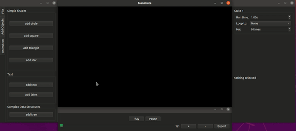
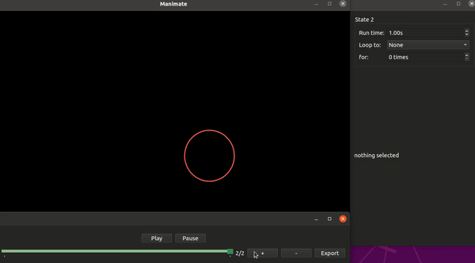
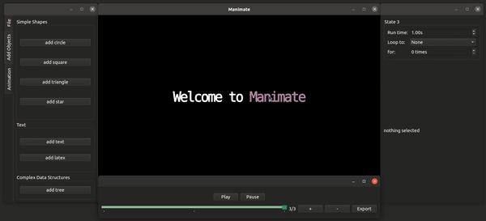
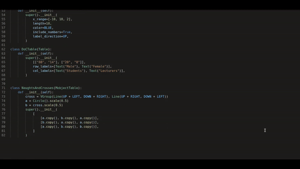

# Manimate

  

Animations made entirely by Manimate.

## Table of Contents
- [Overview](#overview)
- [Features](#features)
- [Installation](#installation)
- [Usage](#usage)
   
## Overview
Manimate is a novel WYSIWYG tool for creating animations with [Manim](https://github.com/3b1b/manim).

It makes it easy for beginners to use the advanced features of Manim without needing to write any code.

## Features

#### Add Objects to Scene

The left panel shows what objects you can add to the scene; e.g. circle, square, text, etc.

#### Modify Objects at State

The right panel shows the details of the current selected object such as colour, size, group and also any attached animations. You can modify and change these values.

#### Add State

The bottom panel controls _state_, otherwise known as _frames_. Use the +, - buttons to add and delete state respectively. You can also play and pause the animation from here.

#### Automatic Interpolation

Simply modify the object at different frames and Manimate with automatically write the Manim code to interpolate for you.

#### Export into Code
  
You can export your animation into Python code at `File -> Export` or at the bottom panel.

#### Complex Data Types - Binary Trees

Binary trees is implemented in Manimate as proof-of-concept for complex data types.

You can interact with the nodes, node value, children and also align the children to space evenly across the screen.

In the future, we could implement arrays, stacks, linked lists, etc.

#### Import Custom User-defined Types

You can import virtually any Manim object into the scene. This can be as complex as you want...

## Installation

### Prerequisites
Install any prerequisites needed to build the project:

- Python3.10 and Pip   
      - Ubuntu: `apt install python3.10 && curl -sS https://bootstrap.pypa.io/get-pip.py | python3.10`
  

### Steps

1. Clone the repository.
2. Navigate into project directory.
3. Install dependencies with `pip install -r requirements.txt`
   
## Usage
Then you can run it by:

3. Navigate to `src` directory
4. Run `python3.10 main.py`

Note: Using Xorgs rather than Wayland will support the GUI better; this is default on most systems.

Have fun!

<!-- 
- Python3.10
- Python3.10 pip - 
- moderngl
- bidict
- IPython 8.0.1
- PySide 6 and 2
- IPython
- Manim community dependencies - `sudo apt install libcairo2-dev libpango1.0-dev ffmpeg` for Ubuntu
- Manim community - `pip install manim` for Ubuntu  -->
